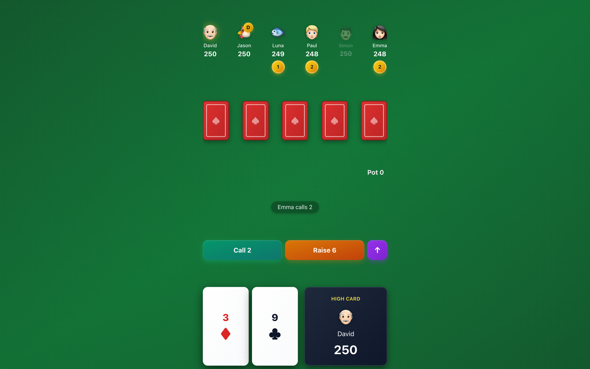
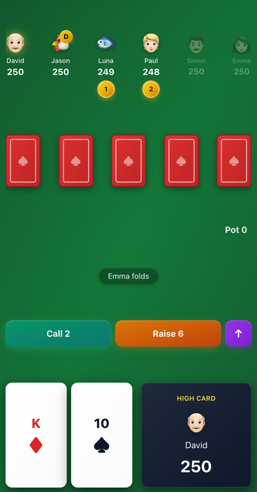
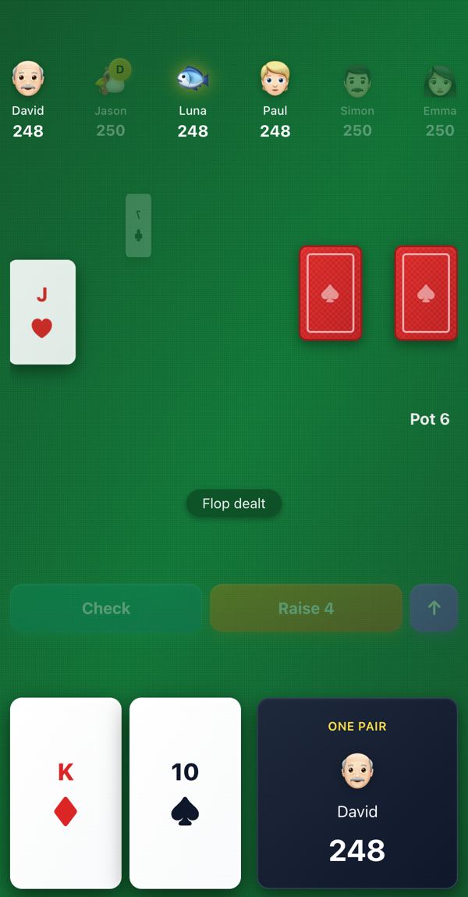
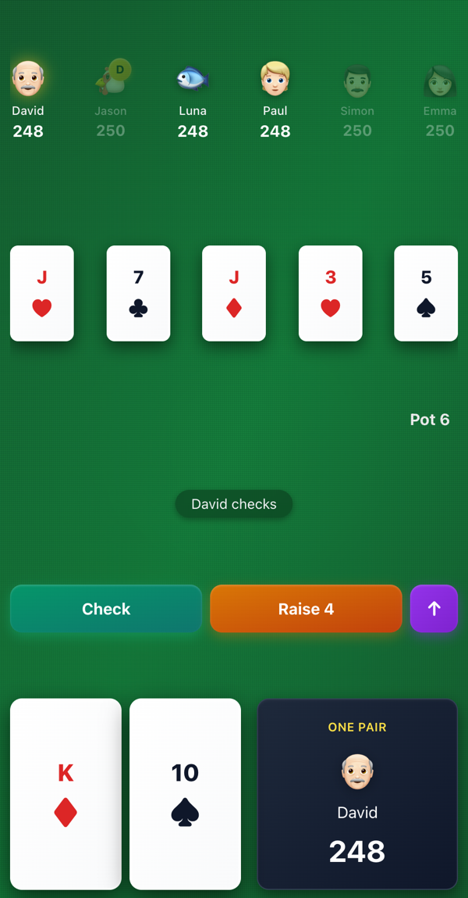

# Texas Hold'em - poker against five computer opponents

> A browser-based Texas Hold'em game against five computer opponents. It handles the deal, blinds, all four betting rounds, hand evaluation, and showdown. The table works on phones and desktops, with card and chip animations and a slider for raising.

**Play it:** https://poker-ebon-two.vercel.app

I built this because I wanted a free poker app without ads or a login. This repository describes the game; the source code is private.

  

---

## Screenshots

  
  
  

## Features

- **Hand sequence:** Deck shuffle, small and big blinds, a rotating dealer button, pre-flop, flop, turn, and river betting rounds, and a showdown that names the winning hand.
- **Hand evaluator:** Finds the best five of seven cards, from high card through straight flush, with kicker tie-breaks.
- **Five AI opponents** who decide fold / call / raise from hand strength and the current bet, with a little variance so they're not predictable.
- **Betting controls:** Check, call, and fold buttons, a raise slider with pot-fraction presets, and an action log ("Emma folds", "David checks").
- **Table:** Felt texture, dealing animations, chips that move to the pot, player avatars, and visible stack sizes. The layout supports portrait phones and wider desktop screens.

## Technologies

React · TypeScript · Vite · Tailwind CSS · Vercel

## Engineering notes

- A reducer-style model holds the players, deck, community cards, phase, active player, and bets. The interface and computer turns use that state.
- Betting rounds track who has acted since the last raise to determine when the round is complete.
- Animations run separately from game logic. Chips move to the pot after the bet is recorded, so the next action can proceed during the animation.

## Status

Built October 2025 (~950 lines). Live.

---

*Bret Merritt · [GitHub](https://github.com/bretm9) · [LinkedIn](https://www.linkedin.com/in/bret-merritt) · merrittbret9@gmail.com*
